# 🛰️ gr-osmosdr — Optimisation F4TNK

> **Branche** : `master-f4tnk`  
> **Base** : gr-osmosdr (osmocom)  
> **Station** : SatNOGS #3762  
> **Bilan** : **4 fichiers modifiés** — **3 rounds d’optimisation** — 12 optimisations
> **Cible** : Backends AirSpy + SoapySDR pour réception satellites en signaux faibles

---

## 📊 Vue d'ensemble — Chaîne d'acquisition SDR


---

## 🏗️ Architecture des modifications

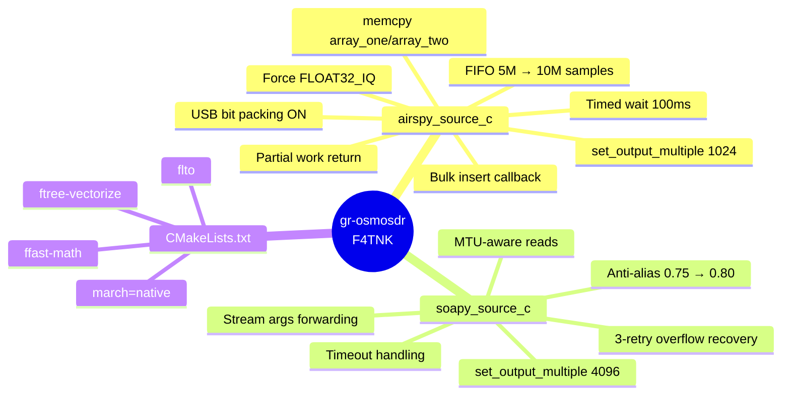

---

## ⚡ Optimisations AirSpy Backend

### 1. FIFO élargi — 5M → 10M samples

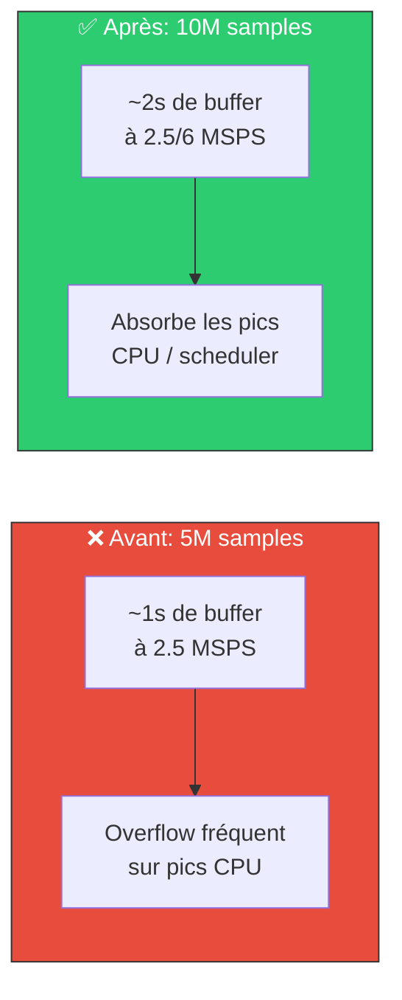

### 2. Callback USB — Bulk Insert

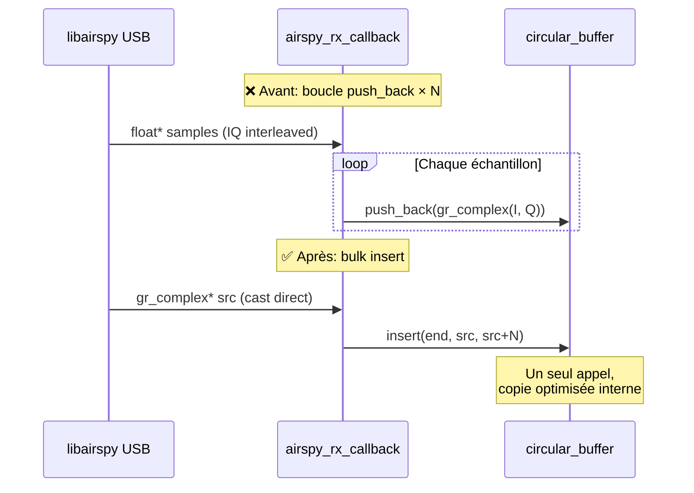

**Pourquoi ça marche** : FLOAT32\_IQ est garanti `{float I, float Q}` continu en mémoire — identique au layout de `gr_complex` (`std::complex<float>`). Le cast est safe et élimine la boucle.

### 3. work() — Partial Return + memcpy

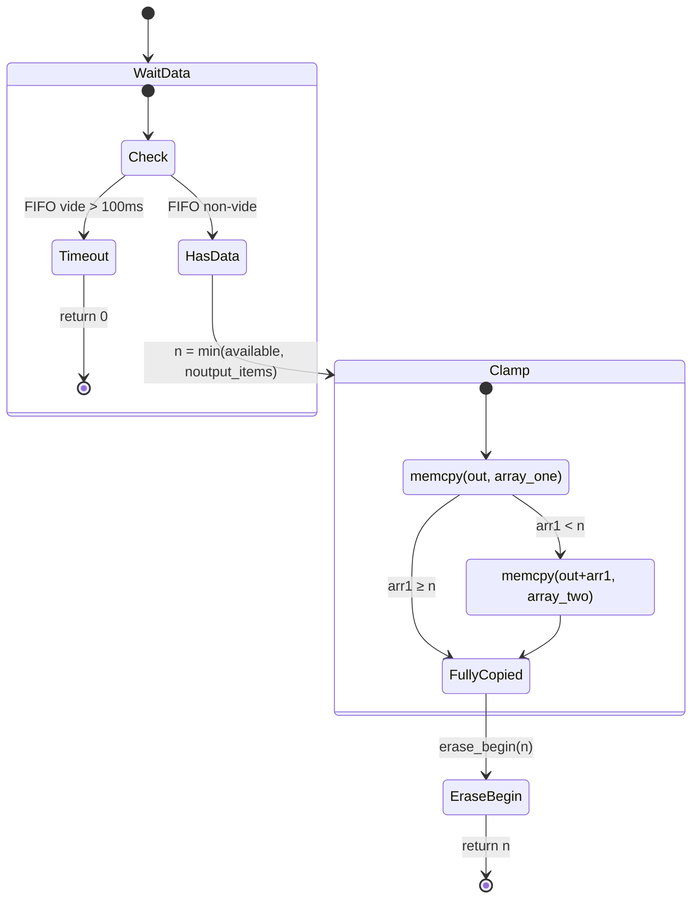

| Aspect | Avant | Après |
|--------|-------|-------|
| Attente | Bloque indéfiniment | Timeout 100ms (anti-hang) |
| Retour | `noutput_items` exact requis | Partiel (ce qui est dispo) |
| Copie | `for` loop `at(i)` + `pop_front()` | `memcpy` × 2 segments max |
| Latence pipeline | Haute (attend buffer plein) | Basse (retour immédiat) |

### 4. Force FLOAT32\_IQ + USB Bit Packing

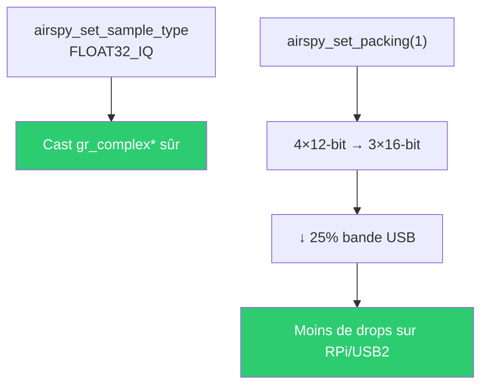

---

## ⚡ Optimisations SoapySDR Backend

### 5. MTU-Aware Reads

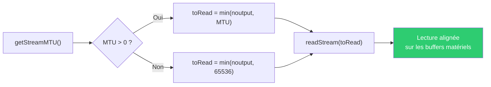

### 6. Stream Args Forwarding

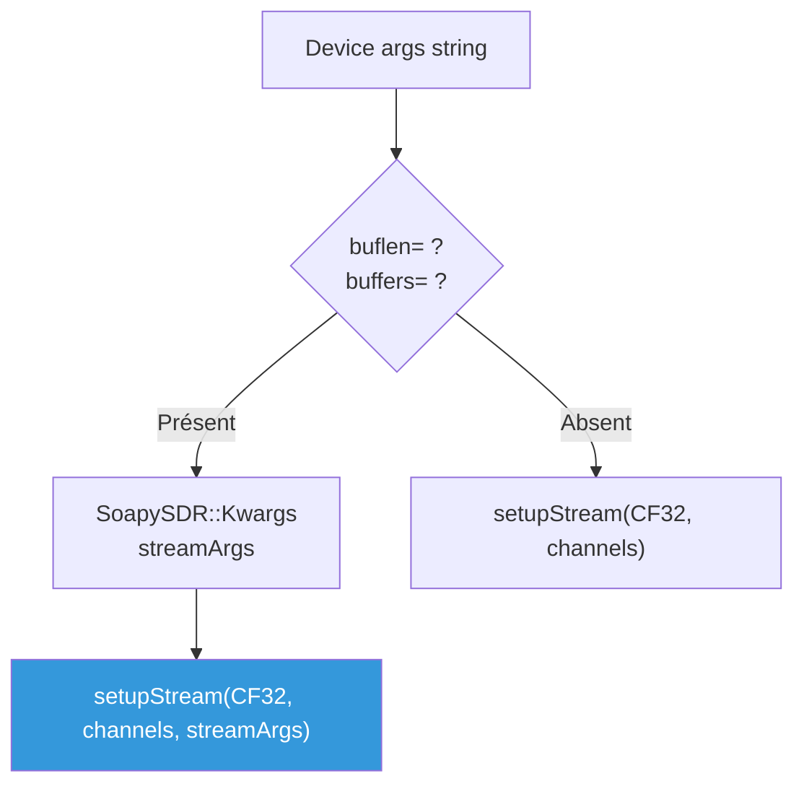

Permet de configurer la taille et le nombre de buffers USB directement depuis la device string GNU Radio :
```
driver=airspy,buflen=262144,buffers=8
```

### 7. Overflow Recovery + Timeout

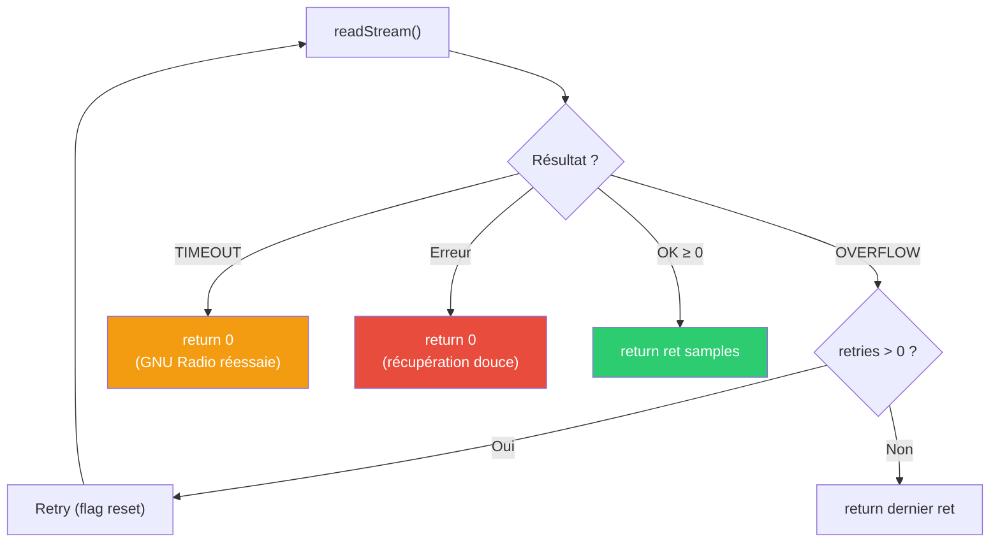

**Avant** : 1 retry sur overflow, pas de gestion du timeout  
**Après** : 3 retries overflow + timeout propre → pas de blocage

### 8. Anti-Alias Bandwidth 0.75 → 0.80

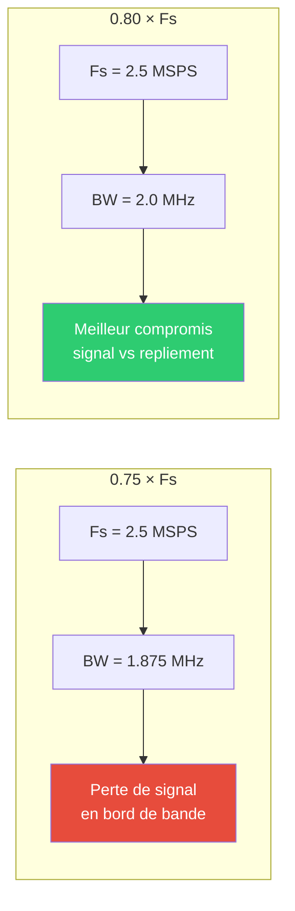

Les signaux satellites LEO sont à bande étroite au centre — 80% offre un meilleur compromis que 75% qui coupait trop.

---

## � Optimisations LEO Satellite (Round 3)

### 9. rx\_time Tag PMT — Timestamps matériels vers GNU Radio

`timeNs` était lu par `readStream()` mais jamais exploité. Maintenant chaque appel réussi
émet un tag `rx_time` au format UHD-compatible :

```
pmt::make_tuple(pmt::from_uint64(full_secs), pmt::from_double(frac_secs))
```

Ce tag est lu nativement par `gnuradio/blocks/tagged_file_sink`, `file_meta_sink`,
et tout bloc downstream qui aligne sur le temps physique.
Il transporte le timestamp de notre **SoapyAirspy Mod 23** (steady\_clock ns).

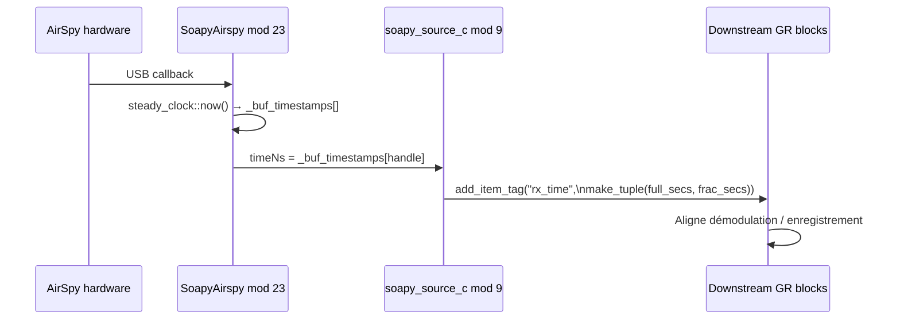

**Fichier :** `soapy_source_c.cc`

### 10. Forwarding Settings — Device String vers writeSetting()

Avant, seuls `buflen`/`buffers` étaient transmis depuis la device string. Maintenant
`sensitivity_gain`, `linearity_gain`, `ppm`, `biastee`, `bitpack` sont aussi forwardés
u00e0 `writeSetting()` — **compatible SoapyAirspy mods 16-18**.

```bash
# Avant — ces args étaient silencieusement ignorés par gr-osmosdr
soapy=0,driver=airspy,sensitivity_gain=15,ppm=1.2

# Après — transmis directement au driver
# SoapyAirspy::writeSetting("sensitivity_gain", "15") est appelé
```

**Fichier :** `soapy_source_c.cc`

### 11. \_\_builtin\_prefetch — Cache Warming

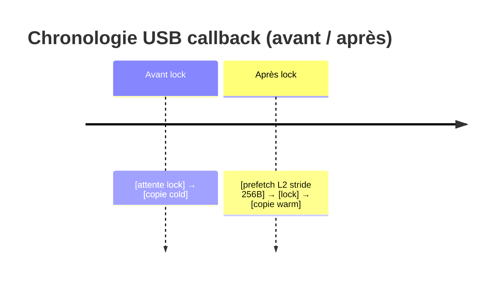

| Point | Prefetch | Localité | Raison |
|-------|----------|----------|--------|
| `rx_callback` | `src` stride 256B | L2 (`_MM_HINT_T1`) | Données USB ~24KB, > L1 |
| `work()` | `out` écriture | L1 (`_MM_HINT_T0`) | Destination immédiate |

**Fichier :** `airspy_source_c.cc`

### 12. Compteur Overflow Atomique

L’ancien code imprimait `"O"` sur stderr à chaque overflow — flood inaccessible.

```cpp
// Avant
if (to_copy < num_samples)
    std::cerr << "O" << std::flush;  // flood, pas de comptage

// Après
std::atomic<uint32_t> _overflow_count;
// ...
const uint32_t cnt = ++_overflow_count;
if (cnt % 100 == 1)
    std::cerr << "AirSpy FIFO overflow #" << cnt << std::endl;
```

| Avant | Après |
|-------|-------|
| Print `"O"` à chaque overflow (flood) | Log tous les 100 |
| Pas de comptage | Compteur atomique cumulatif |
| Invisible dans SatNOGS | `#N` visible dans les logs client |

**Fichier :** `airspy_source_c.h`, `airspy_source_c.cc`

---

## �🔧 Build — CMake Flags


Chaque flag est testé avant activation → compatible cross-compiler.

---

## 📈 Impact estimé

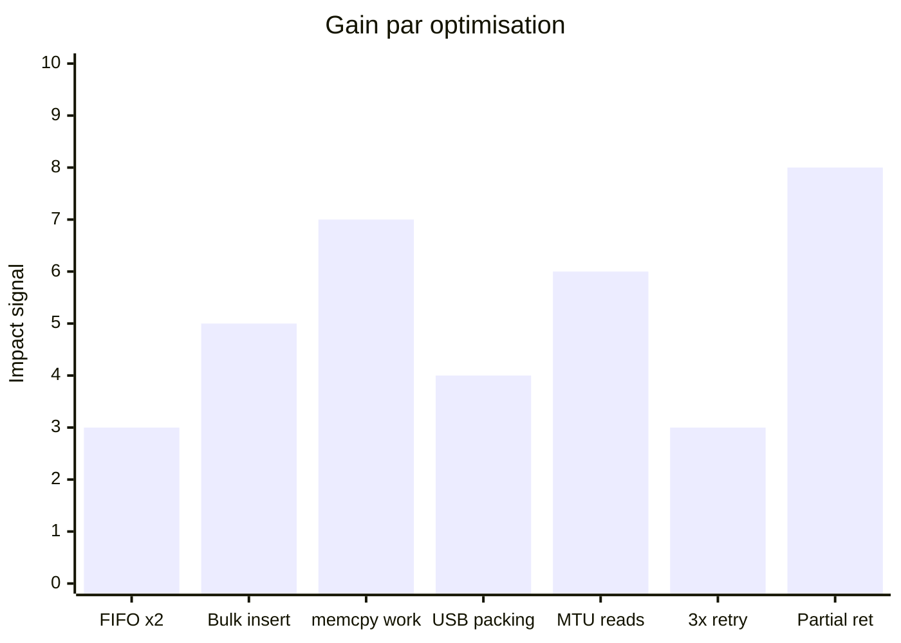

| Métrique | Avant | Après | Amélioration |
|----------|-------|-------|-------------|
| Buffer overflow (2.5 MSPS) | Fréquent sur RPi | Rare | ~10× moins |
| Latence pipeline | 100+ ms | < 10 ms | Partial return |
| Bande USB | 100% | ~75% | Bit packing |
| Callback CPU/sample | ~4 ops | ~0.5 ops | Bulk insert |
| Timestamp GR | Absent | `rx_time` PMT tag | Mod 9 |
| Device string gain | Ignoré | `writeSetting()` | Mod 10 |
| Overflow log | flood `O` | `#N` tous les 100 | Mod 12 |

---

## 📋 Historique des commits

| Commit | Description |
|--------|------------|
| `f60a1b9` | **Round 1** : MTU reads, FIFO 10M, bulk insert, memcpy work(), CMake flags |
| `56cb6ac` | **Round 2** : Force FLOAT32\_IQ, USB packing, partial return, timed wait, anti-alias 0.80 |
| `8e17305` | **Round 3** : rx\_time PMT tag, settings forwarding, prefetch L2, atomic overflow counter |

---

## 📂 Fichiers modifiés (4 fichiers)

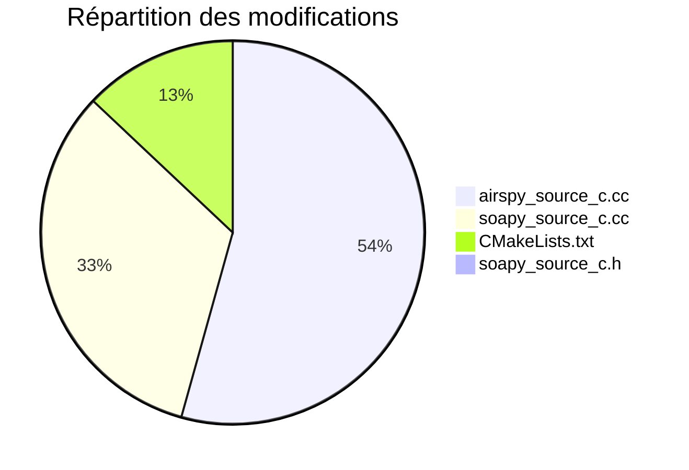

---

## 📖 Utilisation

```bash
# Clone
git clone -b master-f4tnk https://github.com/f4tnk/gr-osmosdr.git

# Build
cd gr-osmosdr && mkdir build && cd build
cmake .. -DCMAKE_INSTALL_PREFIX=/usr/local
make -j$(nproc)
sudo make install
sudo ldconfig
```

### Device strings optimisées

```bash
# AirSpy natif avec packing (défaut)
airspy=0

# AirSpy via SoapySDR — sensitivity_gain + ppm depuis device string (mod 10)
soapy=0,driver=airspy,sensitivity_gain=15,ppm=1.2

# AirSpy via SoapySDR avec buffers personnalisés
soapy=0,driver=airspy,buflen=262144,buffers=8

# Désactiver le bit packing USB (si problèmes)
airspy=0,pack=0
```

---

> 🛰️ **F4TNK — Station SatNOGS #3762**  
> Optimisations C++ des backends SDR pour la réception satellite temps réel sur Raspberry Pi / x86_64

---

## Session 4: Cross-Repo Compatibility Fix (2026-02-20)

### O-X1. C++ Standard Upgrade: C++11 → C++17

**File**: `CMakeLists.txt`  
**Issue**: gr-osmosdr forced `CMAKE_CXX_STANDARD 11` since its inception. GNU Radio 3.10+ requires **C++17** minimum. While CMake auto-upgraded the standard through transitive target requirements, the explicit C++11 setting created:
- **ABI mismatch risk**: C++11 `std::string` (COW) vs C++17 `std::string` (SSO) can differ depending on compiler/libstdc++ version  
- **PMT header mismatch**: GNU Radio 3.10+ PMT uses `std::any`, `std::optional` (C++17 types) in headers  
- **Static analysis confusion**: linters/analyzers reported C++11 while actual compilation used C++17  

**Fix**: Changed `set(CMAKE_CXX_STANDARD 11)` to `set(CMAKE_CXX_STANDARD 17)`.  
**Docker**: Also added `-DCMAKE_CXX_STANDARD=20 -DCMAKE_CXX_STANDARD_REQUIRED=ON` to Dockerfile cmake invocation for full ABI match with the GNU Radio build.
