# 🛰️ gr-osmosdr — Optimization F4TNK

> **Branch** : `master-f4tnk`  
> **Base** : gr-osmosdr (osmocom)  
> **Station** : SatNOGS #3762  
> **Summary** : **4 modified files** — **3 optimization rounds** — 12 optimizations
> **Target** : AirSpy + SoapySDR backends for weak-signal satellite reception

---

## 📊 Overview — SDR Acquisition Chain

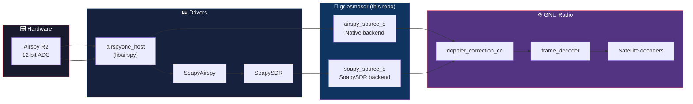

---

## 🏗️ Modification Architecture

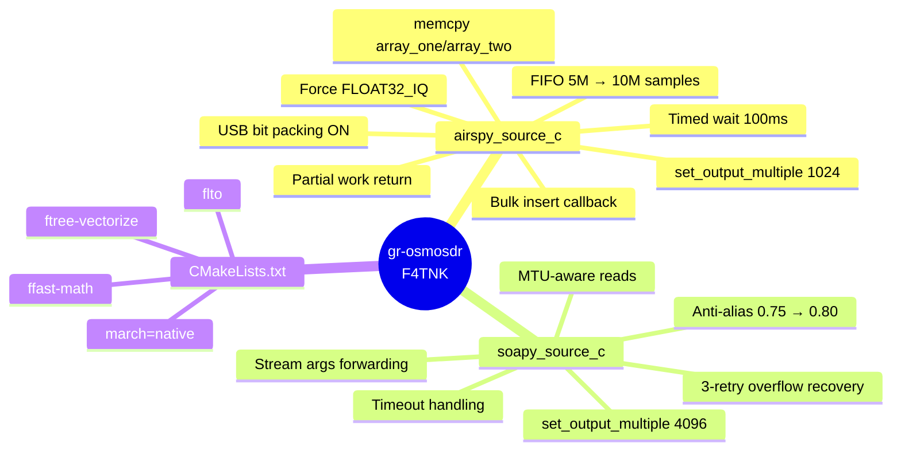

---

## ⚡ AirSpy Backend Optimizations

### 1. Expanded FIFO — 5M → 10M samples

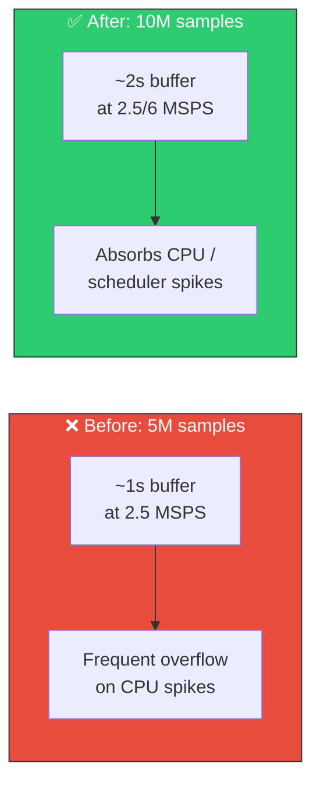

### 2. USB Callback — Bulk Insert

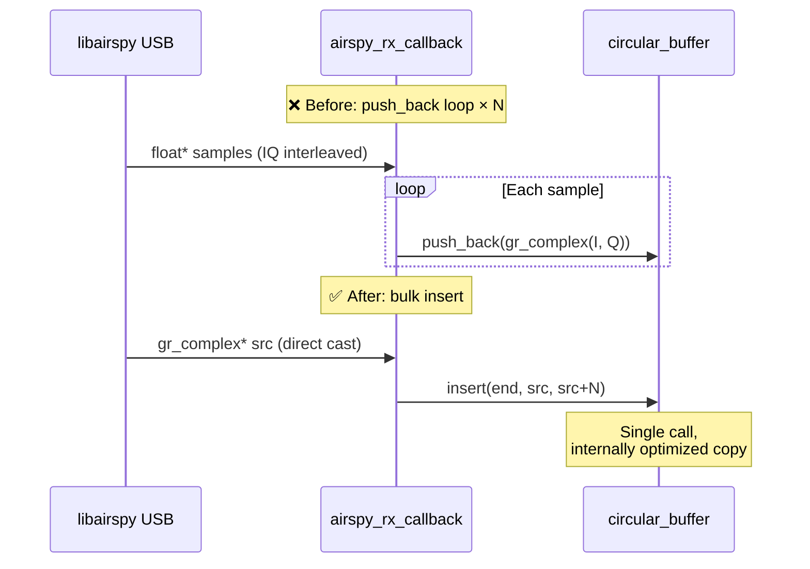

**Why it works**: FLOAT32\_IQ guarantees `{float I, float Q}` contiguous in memory — identical to `gr_complex` (`std::complex<float>`) layout. The cast is safe and eliminates the loop.

### 3. work() — Partial Return + memcpy

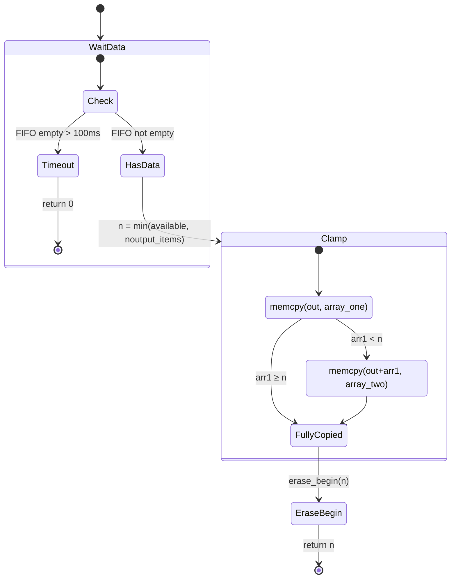

| Aspect | Before | After |
|--------|--------|-------|
| Wait | Blocks indefinitely | 100ms timeout (anti-hang) |
| Return | Exact `noutput_items` required | Partial (whatever is available) |
| Copy | `for` loop `at(i)` + `pop_front()` | `memcpy` × 2 segments max |
| Pipeline latency | High (waits for full buffer) | Low (immediate return) |

### 4. Force FLOAT32\_IQ + USB Bit Packing

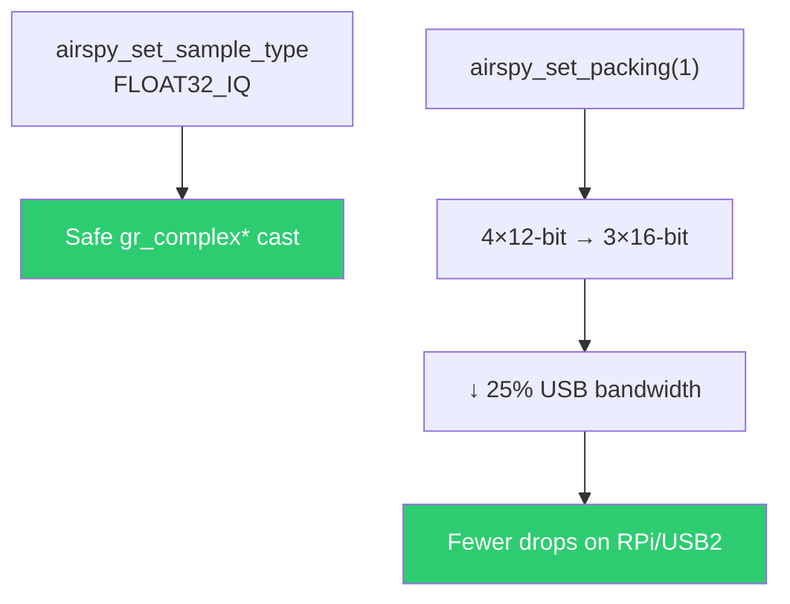

---

## ⚡ SoapySDR Backend Optimizations

### 5. MTU-Aware Reads

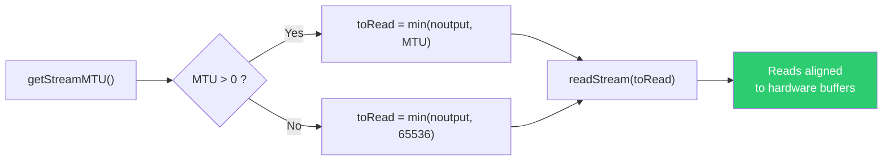

### 6. Stream Args Forwarding


Allows configuring the size and number of USB buffers directly from the GNU Radio device string:
```
driver=airspy,buflen=262144,buffers=8
```

### 7. Overflow Recovery + Timeout

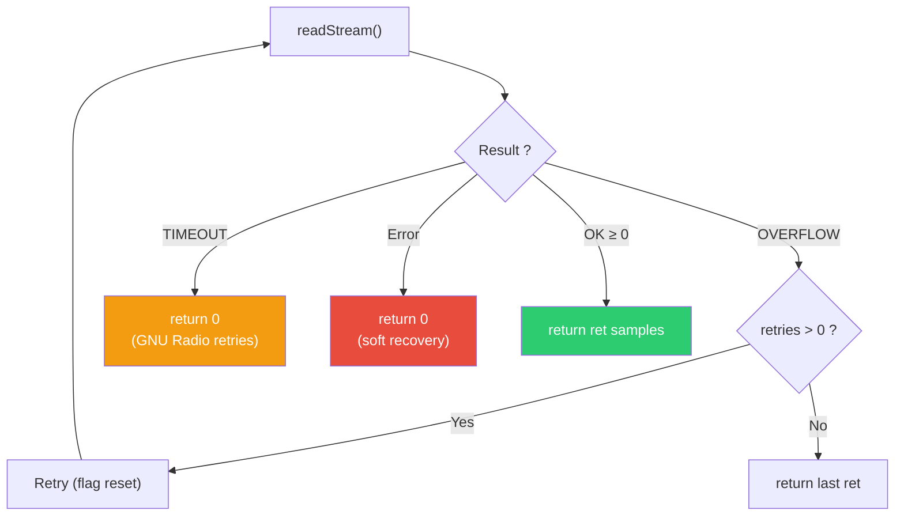

**Before**: 1 retry on overflow, no timeout handling  
**After**: 3 overflow retries + proper timeout → no blocking

### 8. Anti-Alias Bandwidth 0.75 → 0.80

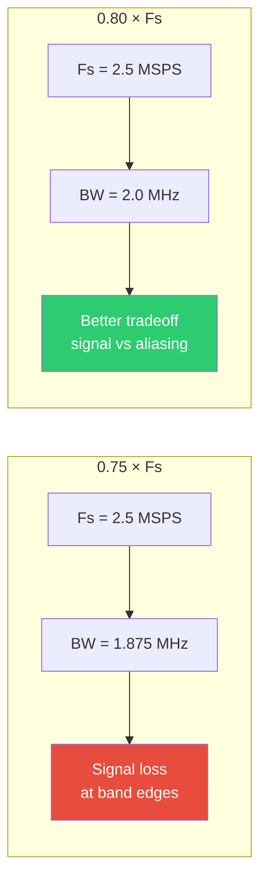

LEO satellite signals are narrowband at center — 80% offers a better tradeoff than 75% which was cutting too much.

---

## 🛰️ LEO Satellite Optimizations (Round 3)

### 9. rx\_time Tag PMT — Hardware Timestamps to GNU Radio

`timeNs` was read by `readStream()` but never exploited. Now each successful call
emits an `rx_time` tag in UHD-compatible format:

```
pmt::make_tuple(pmt::from_uint64(full_secs), pmt::from_double(frac_secs))
```

This tag is natively read by `gnuradio/blocks/tagged_file_sink`, `file_meta_sink`,
and any downstream block that aligns on physical time.
It carries the timestamp from our **SoapyAirspy Mod 23** (steady\_clock ns).

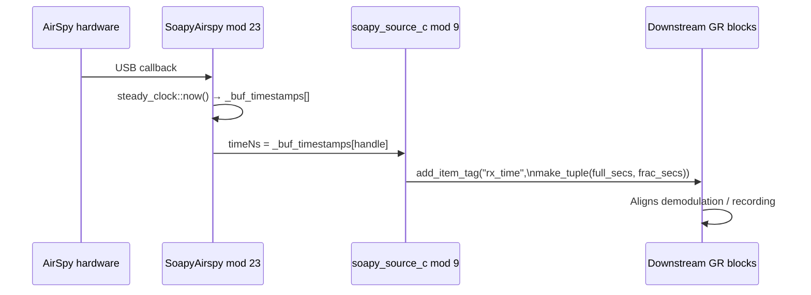

**File:** `soapy_source_c.cc`

### 10. Forwarding Settings — Device String to writeSetting()

Before, only `buflen`/`buffers` were forwarded from the device string. Now
`sensitivity_gain`, `linearity_gain`, `ppm`, `biastee`, `bitpack` are also forwarded
to `writeSetting()` — **compatible with SoapyAirspy mods 16-18**.

```bash
# Before — these args were silently ignored by gr-osmosdr
soapy=0,driver=airspy,sensitivity_gain=15,ppm=1.2

# After — forwarded directly to the driver
# SoapyAirspy::writeSetting("sensitivity_gain", "15") is called
```

**File:** `soapy_source_c.cc`

### 11. \_\_builtin\_prefetch — Cache Warming

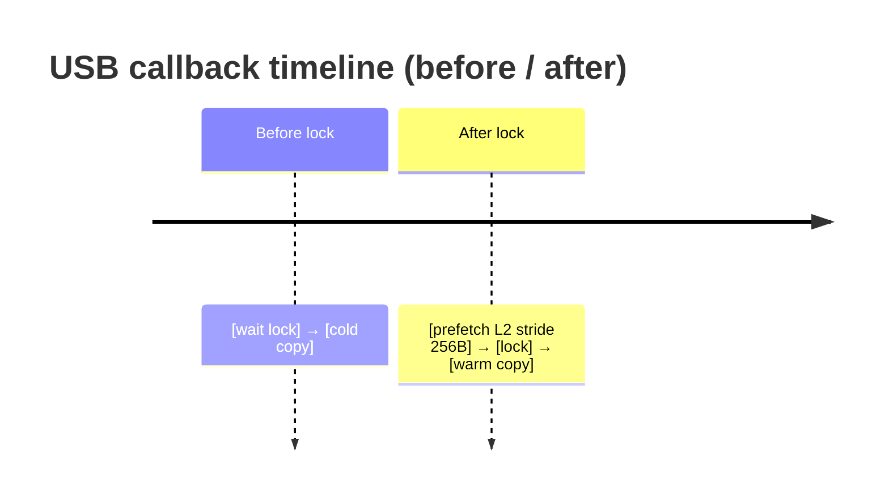

| Point | Prefetch | Locality | Reason |
|-------|----------|----------|--------|
| `rx_callback` | `src` stride 256B | L2 (`_MM_HINT_T1`) | USB data ~24KB, > L1 |
| `work()` | `out` write | L1 (`_MM_HINT_T0`) | Immediate destination |

**File:** `airspy_source_c.cc`

### 12. Atomic Overflow Counter

The old code printed `"O"` to stderr on each overflow — inaccessible flood.

```cpp
// Before
if (to_copy < num_samples)
    std::cerr << "O" << std::flush;  // flood, no counting

// After
std::atomic<uint32_t> _overflow_count;
// ...
const uint32_t cnt = ++_overflow_count;
if (cnt % 100 == 1)
    std::cerr << "AirSpy FIFO overflow #" << cnt << std::endl;
```

| Before | After |
|--------|-------|
| Print `"O"` on each overflow (flood) | Log every 100 |
| No counting | Cumulative atomic counter |
| Invisible in SatNOGS | `#N` visible in client logs |

**File:** `airspy_source_c.h`, `airspy_source_c.cc`

---

## 🔧 Build — CMake Flags

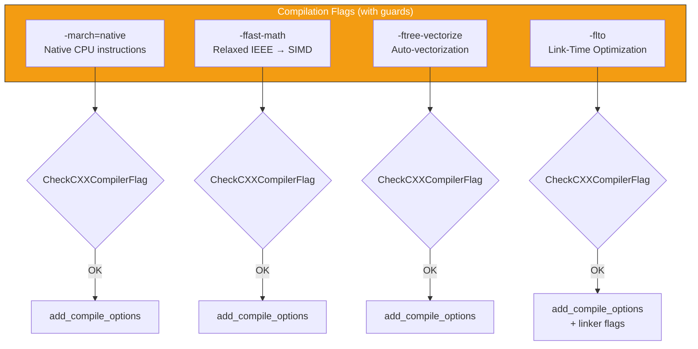

Each flag is tested before activation → cross-compiler compatible.

---

## 📈 Estimated Impact


| Metric | Before | After | Improvement |
|--------|--------|-------|-------------|
| Buffer overflow (2.5 MSPS) | Frequent on RPi | Rare | ~10× fewer |
| Pipeline latency | 100+ ms | < 10 ms | Partial return |
| USB bandwidth | 100% | ~75% | Bit packing |
| Callback CPU/sample | ~4 ops | ~0.5 ops | Bulk insert |
| GR Timestamp | Absent | `rx_time` PMT tag | Mod 9 |
| Device string gain | Ignored | `writeSetting()` | Mod 10 |
| Overflow log | flood `O` | `#N` every 100 | Mod 12 |

---

## 📋 Commit History

| Commit | Description |
|--------|------------|
| `f60a1b9` | **Round 1**: MTU reads, FIFO 10M, bulk insert, memcpy work(), CMake flags |
| `56cb6ac` | **Round 2**: Force FLOAT32\_IQ, USB packing, partial return, timed wait, anti-alias 0.80 |
| `8e17305` | **Round 3**: rx\_time PMT tag, settings forwarding, prefetch L2, atomic overflow counter |

---

## 📂 Modified Files (4 files)

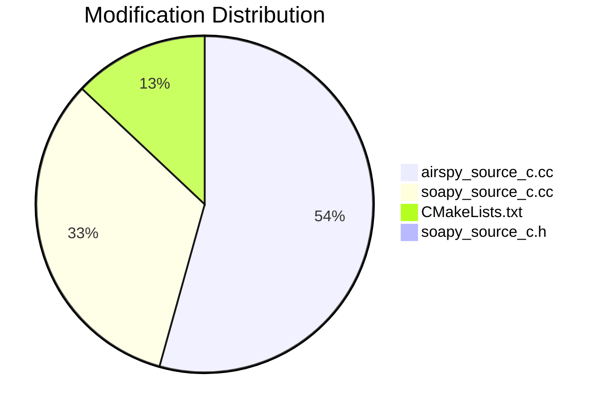

---

## 📖 Usage

```bash
# Clone
git clone -b master-f4tnk https://github.com/f4tnk/gr-osmosdr.git

# Build
cd gr-osmosdr && mkdir build && cd build
cmake .. -DCMAKE_INSTALL_PREFIX=/usr/local
make -j$(nproc)
sudo make install
sudo ldconfig
```

### Optimized Device Strings

```bash
# Native AirSpy with packing (default)
airspy=0

# AirSpy via SoapySDR — sensitivity_gain + ppm from device string (mod 10)
soapy=0,driver=airspy,sensitivity_gain=15,ppm=1.2

# AirSpy via SoapySDR with custom buffers
soapy=0,driver=airspy,buflen=262144,buffers=8

# Disable USB bit packing (if issues)
airspy=0,pack=0
```

---

> 🛰️ **F4TNK — SatNOGS Station #3762**  
> C++ Optimizations of SDR Backends for Real-Time Satellite Reception on Raspberry Pi / x86_64

---

## Session 4: Cross-Repo Compatibility Fix (2026-02-20)

### O-X1. C++ Standard Upgrade: C++11 → C++17

**File**: `CMakeLists.txt`  
**Issue**: gr-osmosdr forced `CMAKE_CXX_STANDARD 11` since its inception. GNU Radio 3.10+ requires **C++17** minimum. While CMake auto-upgraded the standard through transitive target requirements, the explicit C++11 setting created:
- **ABI mismatch risk**: C++11 `std::string` (COW) vs C++17 `std::string` (SSO) can differ depending on compiler/libstdc++ version  
- **PMT header mismatch**: GNU Radio 3.10+ PMT uses `std::any`, `std::optional` (C++17 types) in headers  
- **Static analysis confusion**: linters/analyzers reported C++11 while actual compilation used C++17  

**Fix**: Changed `set(CMAKE_CXX_STANDARD 11)` to `set(CMAKE_CXX_STANDARD 17)`.  
**Docker**: Also added `-DCMAKE_CXX_STANDARD=20 -DCMAKE_CXX_STANDARD_REQUIRED=ON` to Dockerfile cmake invocation for full ABI match with the GNU Radio build.
